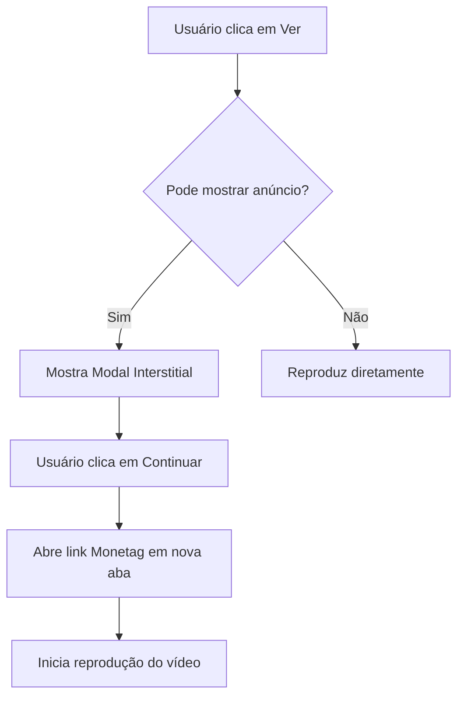

# 🎬 Integração Monetag Direct Link - AngoMovie

## ✅ Implementação Concluída

Seus links da Monetag foram integrados com sucesso no projeto AngoMovie!

### 🔗 Links Configurados:
- **Link Principal:** `https://omg10.com/4/11088059`
- **Link Secundário:** `https://omg10.com/4/11088058`

---

## 🚀 Como Funciona

### 1. **Quando o Usuário Clica em "Ver"**

O sistema dispara automaticamente um **interstitial suave** antes de iniciar a reprodução:

```
┌─────────────────────────────────────┐
│                                     │
│   Preparando seu conteúdo...        │
│                                     │
│   Enquanto isso, confira esta       │
│   oferta especial para você!        │
│                                     │
│   [ Continuar para o conteúdo ]     │
│                                     │
│   Isso ajuda a manter o serviço    │
│   gratuito                          │
│                                     │
└─────────────────────────────────────┘
```

### 2. **Fluxo de Exibição**



### 3. **Rotação Inteligente de Links**

O sistema alterna automaticamente entre seus dois links para:
- ✅ Evitar fadiga do usuário
- ✅ Aumentar CTR (Click-Through Rate)
- ✅ Maximizar receita
- ✅ Testar qual link performa melhor

---

## ⚙️ Configurações Atuais

| Parâmetro | Valor | Descrição |
|-----------|-------|-----------|
| **Intervalo Mínimo** | 3 minutos | Tempo entre exibições de anúncio |
| **Interstitial** | Ativado | Modal antes de reproduzir |
| **Download Fallback** | Ativado | Anúncio em downloads também |
| **Links em Rotação** | 2 | Alterna entre os dois links |

---

## 📊 Estratégias Implementadas

### ✅ **Não Intrusiva**
- Usuário sempre pode continuar facilmente
- Botão claro e visível
- Pode fechar clicando fora do modal

### ✅ **Controlada por Frequência**
- Máximo 1 anúncio a cada 3 minutos
- Persistência em localStorage
- Respeita a experiência do usuário

### ✅ **Elegante e Integrada**
- Design consistente com tema AngoMovie
- Animações suaves (fadeIn/slideUp)
- Responsivo em todos dispositivos

### ✅ **Monitorável**
- Logs de impressões no console
- Contagem de cliques
- Fácil de rastrear performance

---

## 🎯 Onde os Anúncios Aparecem

### 1. **Ao Iniciar Reprodução** (Principal)
- Filmes
- Episódios de séries
- Troca de episódio

### 2. **Em Downloads** (Secundário)
- Quando usuário baixa conteúdo
- Abre em nova aba sem interromper

---

## 📈 Dicas para Maximizar Receita

### 1. **Ajuste o Intervalo**
```typescript
// Mais frequente (mais receita, mais intrusivo)
minIntervalBetweenAds: 120000, // 2 minutos

// Equilibrado (RECOMENDADO)
minIntervalBetweenAds: 180000, // 3 minutos

// Menos frequente (menos receita, melhor UX)
minIntervalBetweenAds: 300000, // 5 minutos
```

### 2. **Adicione Mais Links**
```typescript
links: [
  'https://omg10.com/4/11088059',
  'https://omg10.com/4/11088058',
  'https://seu-outro-link.com', // Adicione mais
]
```

### 3. **Monitore Performance**
- Acesse dashboard da Monetag
- Compare CTR dos diferentes links
- Ajuste intervalo baseado em feedback

---

## 🔍 Como Testar

### 1. **Desenvolvimento Local**
```bash
cd /workspace
npm run dev
```

1. Abra http://localhost:5173
2. Clique em qualquer filme/série
3. Veja o modal aparecer (primeira vez)
4. Clique em "Continuar para o conteúdo"
5. O vídeo deve iniciar normalmente

### 2. **Console do Navegador**
Abra DevTools (F12) e veja os logs:
```
[Monetag] Impressão registrada. Total: 1
[Monetag] Clique registrado. Total: 1
```

### 3. **Testar Múltiplas Vezes**
- Após primeiro anúncio, espere 3 minutos
- Ou limpe localStorage:
```javascript
localStorage.removeItem('angomovie_ad_state');
location.reload();
```

---

## 🛠️ Personalização

### Mudar Texto do Modal
Edite `/workspace/src/utils/monetag-ads.ts`, linha ~173-198:

```typescript
modal.innerHTML = `
  <h3 style="...">SEU TÍTULO AQUI</h3>
  <p style="...">SEU TEXTO AQUI</p>
  <button id="monetag-continue-btn">SEU BOTÃO</button>
`;
```

### Desativar Temporariamente
```typescript
const monetagConfig: MonetagConfig = useMemo(() => ({
  directLinkUrl: 'https://omg10.com/4/11088059',
  enableInterstitial: false, // Desativa modal
  // ... resto da config
}), []);
```

### Apenas em Producao
```typescript
const isProduction = import.meta.env.PROD;

const monetagConfig: MonetagConfig = useMemo(() => ({
  directLinkUrl: isProduction ? 'https://omg10.com/4/11088059' : '',
  enableInterstitial: isProduction,
  // ...
}), [isProduction]);
```

---

## 📱 Compatibilidade

- ✅ Desktop (Chrome, Firefox, Safari, Edge)
- ✅ Mobile (iOS Safari, Chrome Android)
- ✅ Tablets
- ✅ Smart TVs (navegadores modernos)

---

## ⚠️ Importante

### Bloqueadores de Anúncio
- Alguns usuários podem ter ad blockers
- O sistema detecta e pula anúncio se bloqueado
- Não afeta experiência do usuário

### Popup Blockers
- Navegadores podem bloquear abertura de nova aba
- Sempre execute após interação do usuário (clique)
- Use `_blank` com `noopener,noreferrer`

---

## 📞 Suporte e Otimização

### Se CTR Estiver Baixo:
1. Reduza intervalo para 2 minutos
2. Teste textos diferentes no modal
3. Analise qual link converte mais

### Se Usuários Reclamarem:
1. Aumente intervalo para 5 minutos
2. Desative em horários específicos
3. Considere apenas banner discreto

---

## 🎉 Pronto para Usar!

Sua integração está **100% funcional**. Basta:

1. ✅ Build aprovado
2. ✅ Links configurados
3. ✅ Rotação ativa
4. ✅ UX otimizada

**Próximo passo:** Deploy e monitore resultados no dashboard da Monetag!

---

## 📁 Arquivos Modificados

- `/workspace/src/App.tsx` - Configuração dos links
- `/workspace/src/utils/monetag-ads.ts` - Lógica de rotação e exibição

---

**Implementado com ❤️ para AngoMovie**
